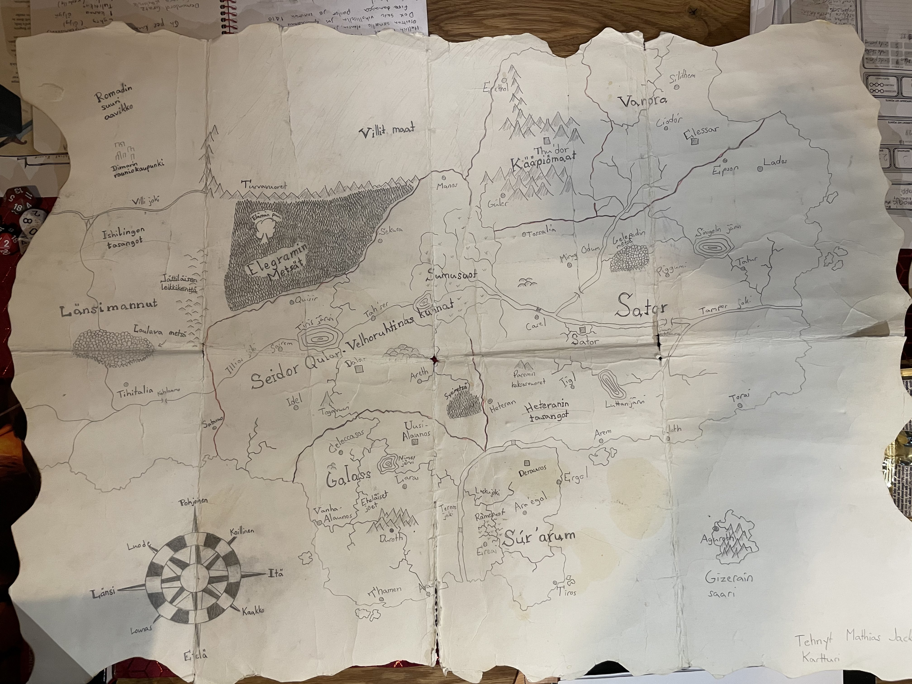

[Takaisin](../README.md)

# Tunnetut paikat ja NPC:t

Paikat ja ei-pelaajahahmot, jotka ovat tulleet tutuiksi tai mainittu merkittävällä tavalla pelin aikana

 

## Tunnetun maailman kartta

 

## Paikat

Tunnetut paikat

- Sator
    - Ihmisten valtakunta, joka jaettu kolmeen eri osaan
    - Veljeskylät (Ylä- ja Alakylä)
        - Kylien läpi virtaavan joen rannalla välimatkalla sijaitsi aiemmin Veljeskylien kirkko (poltettu)
        - Yläkylän lähistöllä on Konnasuo
    - Tanhos
        - Pienimuotoinen kauppala Yläkylältä noin 5 päivän matkan verran jokea ylävirtaan
    - Tossalia
        - Rujo, mutta käytännönläheinen suurkaupunki Satorin pohjoisosissa
        - Väestökanta koostuu pääosin ihmisistä ja kääpiöistä
        - Kääpiöiden vuoksi kaupungissa suhtautuminen magiaan on nihkeää
    - Mirug Odum
        - Isompi kaupunki Veljeskyliltä etelään
    - Galass
        - Tunnetun maailman itämainen osa etelässä
- Sumusuot
    - Tunnetun maailman hengenvaarallisin osa
    - Rämelinna 
        - Sumusoiden lähistöllä
        - Tossaliasta Rämelinnalle päin menee tie ja sen matkalla on Viimeinen Vartio, josta on vielä viikon matka Rämelinnalle

 

## Jumalat & uskonnot

- Pelor (NG)
    - Ihmisten palvoma auringon ja parantamisen jumala
- St. Cuthberg (LN)
    - Maalaisjärjen ja intohimon jumala
- Fharlanghn (TN)
    - Horisontin ja matkustamisen jumala
- Kord (CG)
    - Ihmisten urheilun ja kilvoittelun jumala
- Moradin (LG)
    - Kääpiöiden luomisen jumala
- Boccob (NG)
    - Magian jumala
- Wee Jas (LN)
    - Magian ja kuoleman jumalatar
- Olidammara (CN)
    - Varkaiden ja harmaalla alueella toimimisen jumala

### Entisajan sankarit

- Lordulin
    - Käynyt tarinoiden mukaan mm. Sumusoilla, tappanut Hydran ja perustanut Tossalian urheilukoulun

 

## NPC:t

Aatelisilla on eri arvoja, jotka vaihtelevat valtakunnan mukaan

*Satorissa:* Paroni alempi arvo kuin kreivi, herttua voi olla jos kuninkaan perillinen. Satorin läntistä osaa johtaa kuningas ja kahta muuta osaa johtaa herttua (prinssi Miio)

### Elossa

- Prinssi Mio
    - Satorin tuleva kuningas
- Vendi
    - Veljeskylien kirkon papin apupoika
- Denes
    - Alakylän de-facto johtaja
    - Tytär: Ylva
- Haahka
    - Yläkylän salaperäinen rohtokauppias
- Elias & Haggert
    - Yläkylän johtohahmoja. Elias vanhempi ja de-facto johtaja
- Quantos
    - Yläkylän liepeillä asuva alkemisti
- Punasilmä
    - Örkkijohtaja, joka haluaa kerätä armeijan ja hyökätä Tossaliaan
- Ahlal Aurelius
    - Kiertävä fauni trubaduuri
- Gisden Adler
    - Tanhoksen Kultainen Saapas tavernan omistaja
    - Serkku: Farah Adler (nainen, asuu Tossaliassa)
- Ruben Madros
    - Tanhoksen kupunginjohtaja ja lasinpuhaltajakillan johtaja
- Donte Falatis
    - Tanhoksen vouti
    - Lasikaupungin Lunan aarteesta hyvin kiinnostunut
- Isä Danio
    - Tanhoksen Pelorin kirkon pappi
- Max
    - Gisdenin tuttu, joka oli Tanhoksen vankilassa
    - Fortune auttoi vankilasta pakoon antamalla Gisdenin tekemän taikajuoman
- Jonata
    - Tanhoksen hevostallin pitäjä
- Elisa Juvenothi & Mathos
    - Elisa on Juvenothi-suvun kreivitär, joka matkasi henkivartiansa Mathoksen kanssa Tossaliaan politiikan vuoksi 
    - Yrittävät estää ihmisten välisen sodan
- Kreivi Fimdal
    - Tossalian hallitsija, joka asuu Harmaalinnassa
    - Tummatukkainen, noin kolmikymppinen
- Kreivitär Lorella Gaudeo & Paroni Reagon Enshild
    - Kreivi Fimdalin taustajoukkoja
- Harmek
    - Tossalian Moradinin pappi
- Kelmin
    - Tossaliassa asuva kivitonttu / maahinen keksijä (artificer)
- Professori Douran
    - Tossalian yliopiston professori
- Van Siu & Jan Fagerholm
    - Tossalialaisia kauppiaita, joilla liiketoimintaa myös lain harmaalla aluella
    - Siu ylläpitää suitsukekauppaa, Fagerholm pyörittää uhkapelirinkiä
    - Molemmat bordellin vakioasiakkaita
- Leijonatar
    - Tossalian bordellin ylläpitäjä

### Kuolleet

- Isä Mundum
    - Veljeskylien kirkon (Pelor) pappi. Kuoli Vendin käsissä puukotukseen, kun Eghart oli lumonnut Vendin.
- Jorro
    - Alakylän puoliörkki metsästäjä. Kuoli örkkihyökkäyksessä.
- Grorrak
    - Veljeskylien alueella asunut pienimuotoinen örkkijohtaja.
- Eghart
    - Demoni, joka asui Yläkylässä ja oli lumonnut kyläläiset.
- Sara 
    - Eliaksen tytär. Poltettiin roviolla.
- Isä Volovin
    - Tanhoksen St. Cuthbergin kirkon pappi. Kuoli Vrockien hyökkäyksessä.
- Turpakärsä
    - Pienen rikollisjengin johtaja Tossalian ja Tanhoksen välimaastossa
- Mikkos Enderlon
    - Tossalialainen porvari, joka kuoli mahdollisesti kuristamiseen
    - Ollut aiemmin mukana bordelli- / alkoholi- / hautajais- ja kiristystoiminnassa
